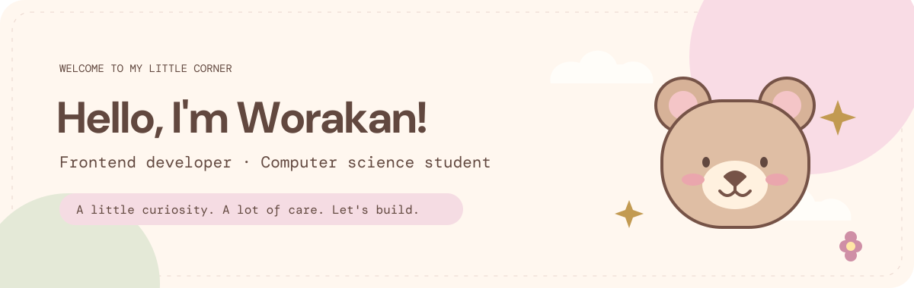

 

**Thoughtful interfaces, tiny details & a little everyday magic.** 🌷

Building friendly web experiences with React, Next.js and TypeScript.

 

[About me](#about-me) · [Selected work](#selected-work) · [My toolbox](#my-toolbox) · [Activity](#github-activity) · [Say hello](#say-hello)

 

## 🧸 A little about me

Hello! I'm **Worakan Pongseelawat**, a Computer Science student at the Faculty of Science and Technology, [Rajamangala University of Technology Suvarnabhumi (RMUTSB)](https://rmutsb.ac.th/en).

I enjoy turning ideas into **responsive, functional and friendly web applications**. My favorite way to learn is to build something real, pay attention to the small details, and make it a little better each day.

| 🌱 Growing | 🪡 Creating | 💌 Open to |
| :--- | :--- | :--- |
| Learning Next.js, TypeScript & SwiftUI | Building frontend projects, one step at a time | Internships, learning & collaboration |

<b>☁️ A few more things about me</b>

- I love building polished, responsive web experiences.
- I learn best by turning new ideas into real projects.
- My current goal is to grow into a confident frontend developer.

 

<h2 align="center">🌷 Things I've been making</h2>

A small collection of websites, apps and ideas I'm bringing to life.

| Project | Built with | Status & links |
| :--- | :---: | :---: |
| **Keep Going** ✨ | Coming soon |  |
| **Todo List** 📋 | Web application |   |
| **Cafe Cat** ☕🐈 | Responsive website |   |
| **M Cat 031** 📱 | Interactive prototype |  |
| **Go with us** 🗺️ | Swift |  |
| **Portfolio** 🎨 | TypeScript |  |

 

<h2 align="center">🎨 My little toolbox</h2>

The technologies I use to turn a blank canvas into something useful.

### Interfaces & interactions

### Behind the scenes

### From idea to shipped

 

**Things I care about** · Responsive layouts · Clear interactions · REST APIs · Databases · Git workflow

 

## 🌱 Growing a little every day

Learning, experimenting and making progress, one commit at a time.

A peek at my coding journey. Activity cards update through external services.

 

## 💌 Let's make something lovely

I'm open to internships, learning opportunities and thoughtful collaborations.

**Have a look around — I'm happy you're here.**

[Explore my portfolio](https://worakan-portfolio1.vercel.app/about) · [Find me on GitHub](https://github.com/omworakarn-maker)

 

